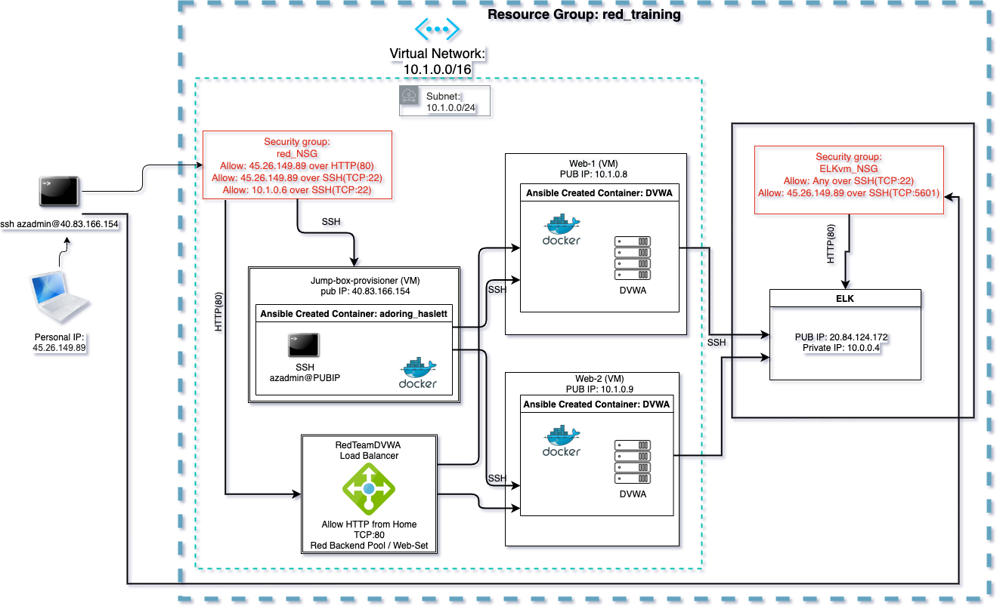

## Automated ELK Stack Deployment

The files in this repository were used to configure the network depicted below.

These files have been tested and used to generate a live ELK deployment on Azure. They can be used to either recreate the entire deployment pictured above. Alternatively, select portions of the install-elk.yml file may be used to install only certain pieces of it, such as Filebeat.

  - [install-elk.yml](install-elk.yml)

This document contains the following details:
- Description of the Topology
- Access Policies
- ELK Configuration
  - Beats in Use
  - Machines Being Monitored
- How to Use the Ansible Build

### Description of the Topology

The main purpose of this network is to expose a load-balanced and monitored instance of DVWA, the D*mn Vulnerable Web Application.

Load balancing ensures that the application will be highly effecient, in addition to restricting DDoS attacks to the network.

The Jump Box Provisioner has the sole responsibility to provide updates on the storage area network without having to update each virtual machine connected to the resource group.

Integrating an ELK server allows users to easily monitor the vulnerable VMs for changes to the data and system logs.

[Filebeat monitors the log files or locations that you specify, collects log events, and forwards them either to Elasticsearch or Logstash for indexing.](https://www.elastic.co/guide/en/beats/filebeat/current//filebeat-overview.html)

[Metricbeat takes the metrics and statistics that it collects and ships them to the output that you specify, such as Elasticsearch or Logstash.](https://www.elastic.co/guide/en/beats/metricbeat/7.14/metricbeat-overview.html#:~:text=Metricbeat%20takes%20the%20metrics%20and,HAProxy)

<!-- The configuration details of each machine may be found below.
_Note: Use the [Markdown Table Generator](http://www.tablesgenerator.com/markdown_tables) to add/remove values from the table_. -->

| Name     | Function | IP Address       | Operating System |
|----------|----------|------------------|------------------|
| Jump Box | Gateway  | 40.83.166.154    | Linux            |
| Web-1    | Host     | 10.1.0.8         | Linux            |
| Web-2    | Host     | 10.1.0.9         | Linux            |
| ELKvm    | ELK Host | 10.1.0.6         | Linux            |

### Access Policies

The machines on the internal network are not exposed to the public Internet.

Only the Jump Box Provisioner machine can accept connections from the Internet. Access to this machine is only allowed from the following IP addresses: _45.26.149.89_

Machines within the network can only be accessed by the DVWA Docker Container. 
- [install-dvwa.yml](dvwa-playbook.yml)
<!-- - _TODO: Which machine did you allow to access your ELK VM? What was its IP address?_ -->
The Jump Box Provisioner's IP is the only machine allowed to access the ELKvm: _40.83.166.154_

A summary of the access policies in place can be found in the table below.

| Name     | Publicly Accessible | Allowed IP Addresses |
|----------|---------------------|----------------------|
| Jump Box | Yes/No              | 10.0.0.1 10.0.0.2    |
|          |                     |                      |
|          |                     |                      |

